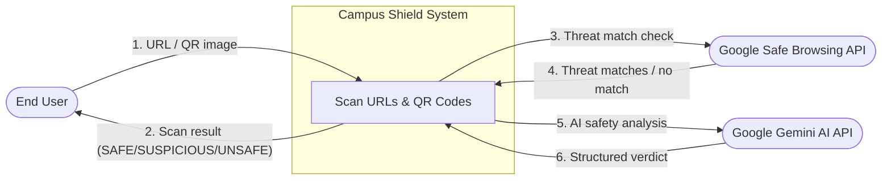
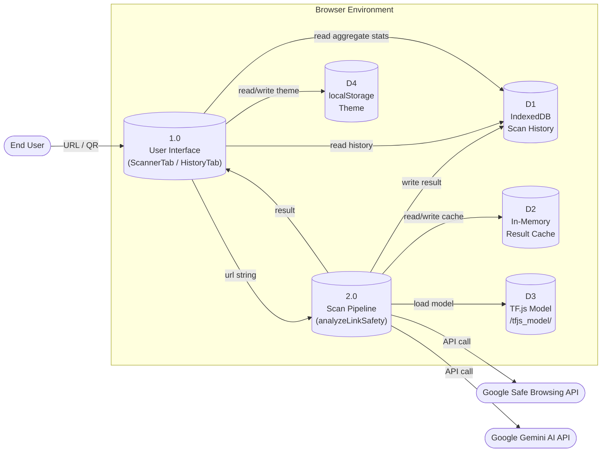
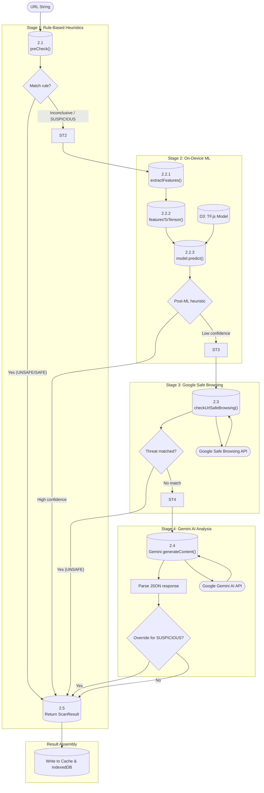
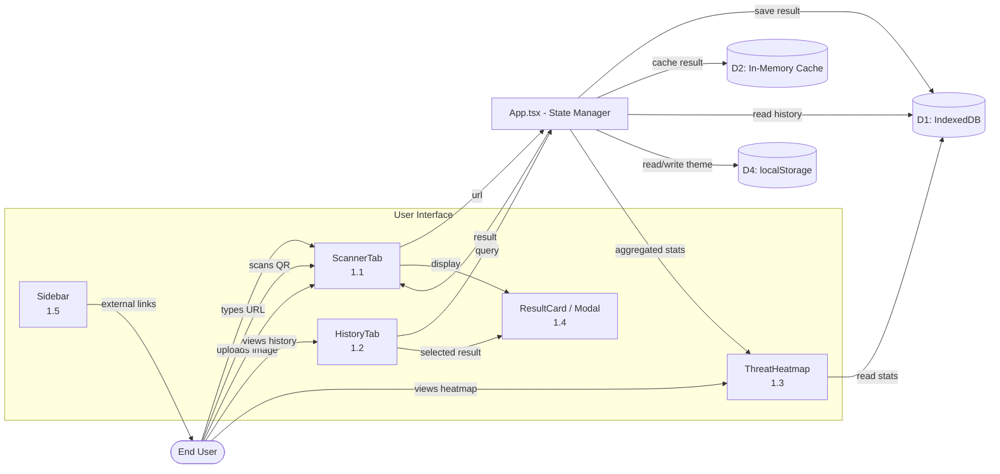

# Campus Shield — Data Flow Diagram

## Level 0: Context Diagram

---

## Level 1: Main Processes & Data Stores

---

## Level 2: Detailed Scan Pipeline (Process 2.0)

---

## Level 2: User Interface Data Flows (Process 1.0)

---

## Data Store Definitions

| ID | Store | Technology | Description |
|----|-------|-----------|-------------|
| D1 | Scan History | IndexedDB (Dexie) | Persistent log of all URL scan results |
| D2 | Result Cache | Map<string, ScanResult> | In-memory session cache to avoid re-scanning the same URL |
| D3 | TF.js Model | Static files (`/tfjs_model/`) | Pre-trained neural network for URL classification |
| D4 | Theme | localStorage | User's dark/light mode preference |

## External Entity Definitions

| Entity | Description | Data Flow Direction |
|--------|-------------|---------------------|
| End User | Person submitting URLs or QR codes for scanning | Bidirectional |
| Google Safe Browsing | Google API for checking URLs against known threat databases | App → API (request), API → App (response) |
| Google Gemini AI | Google Gemini 2.0 Flash LLM for deep semantic URL analysis | App → API (request), API → App (response) |

## Data Flow Descriptions

| # | Flow | From | To | Data |
|---|------|------|----|------|
| 1 | URL / QR Image | User | ScannerTab | URL string or ImageData from QR decode |
| 2 | Scan Result | App | User | ScanResult {id, url, status, reason, title, description} |
| 3 | Threat Match Check | Scan Pipeline | Safe Browsing API | POST: {client, threatInfo {url, threatTypes}} |
| 4 | Match Response | Safe Browsing API | Scan Pipeline | JSON: {matches: [{threatType, threat, ...}]} |
| 5 | AI Safety Analysis | Scan Pipeline | Gemini API | POST: {contents: [{parts: [{text: prompt + url}]}]} |
| 6 | AI Verdict | Gemini API | Scan Pipeline | JSON: {status, reason, title, description} |
